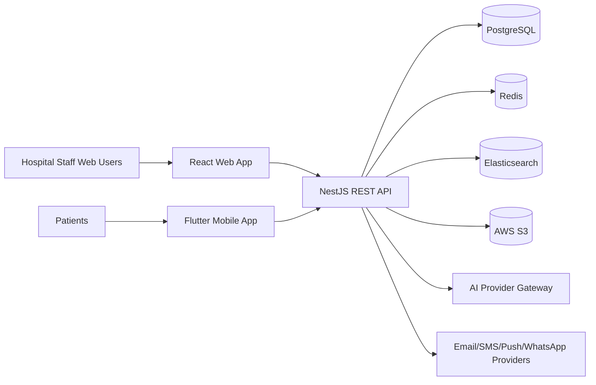
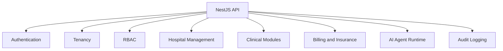

# Architecture

## System Context

## Backend Layout

## Tenancy Model

All tenant-owned records include `tenant_id`. API requests resolve tenant context from authenticated claims and verified domain mappings. Database policies and service-layer guards enforce isolation.
